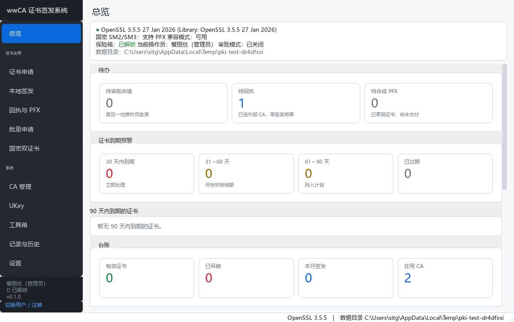
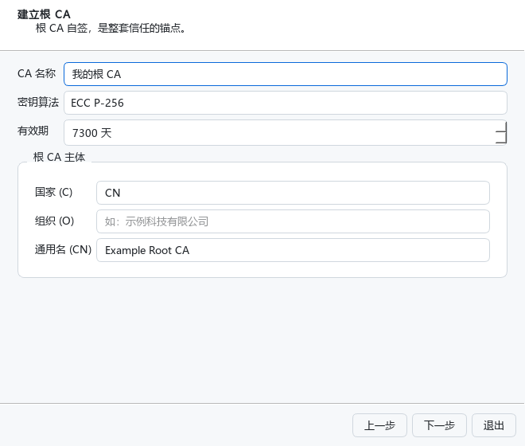
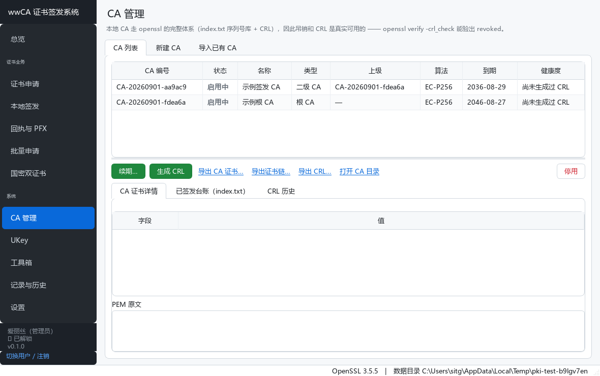
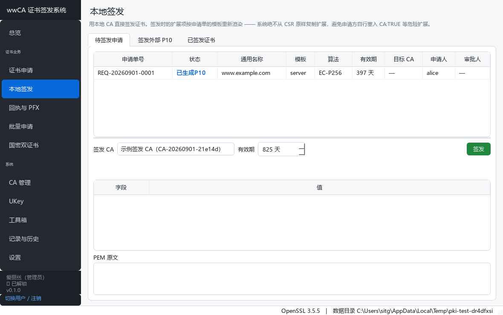
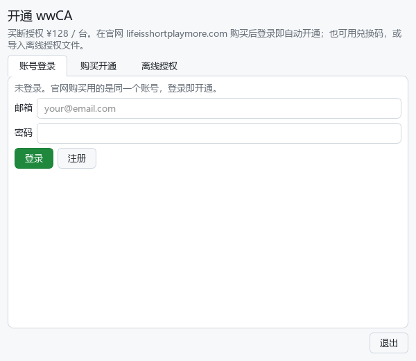

<div align="center">

# 🔐 wwCA · 证书签发与管理系统

### 你自己的本地证书签发中心 —— 建 CA、签证书、合成 PFX,全在本机

对外送申请、对内自建 CA 直接签发;吊销、CRL、国密、批量、审计留痕一应俱全。<br>
所有密码学操作由 OpenSSL 命令行完成,每一条命令都脱敏留痕 —— 出问题查得到、说得清。

**[🌐 访问官网](https://lifeisshortplaymore.com)** &nbsp;|&nbsp; **[⬇ 最新便携版 · Releases](../../releases/latest)**



<sub>Windows 10/11 · 绿色免安装 · 数据全在本地 · 买断授权(¥128 / 台,永久)</sub>

</div>

---

## 📖 这是什么

**wwCA** 是一个桌面证书签发与管理系统。给需要**自己签发、自己管**证书的人:企业内网 TLS、设备/客户端证书、国密双证书、离线授权凭据……不想把私钥托付给在线服务、也不想每次都手搓一长串 `openssl` 命令的人。

它覆盖两条主线业务:

1. **对外**:本地生成密钥 → 生成 P10 申请书 → 送外部 CA 签发 → 导入回执 → 与本地私钥合成 PFX 交付。
2. **对内**:自建完整本地 CA(根 CA + 二级 CA)→ 直接签发终端证书 → 吊销 → 生成 CRL。

全流程留痕:每张证书从申请、审批、签发/送出、回执、合成到吊销的完整生命周期可查,并记录**每一条实际执行的 openssl 命令**,便于审计与排错。

> 它不是在线 CA 服务、不联网、不注册账号。它是那种"钥匙、CA、证书都攥在自己手里"的本地签发中心 —— 装完就是一套能用的私有 PKI。

<div align="center"></div>

---

## ✨ 核心功能详解

### 🏛 完整的本地 CA 体系,不是模拟

- 走真实的 `openssl ca` 全套:每个 CA 独立目录、`index.txt` 序列号库、`newcerts` 归档,**吊销与 CRL 是真实可用的**。
- **根 CA + 二级签发 CA** 分级:根只签二级、二级签终端证书,符合分级信任惯例;初始化向导一步带你建好两级。
- 支持导入既有 CA(粘贴 key+cert 或 PFX),自动重建目录并从现有证书恢复序列号起点。
- 证书模板:server / client / codesign / email / subca / 国密签名 / 国密加密,各自定义 KU、EKU、basicConstraints、有效期;**模板可在界面里增删改**,并挂**自定义扩展**(证书策略 OID、名称约束、任意 OID 扩展),签发时按模板重渲染、绝不从 CSR 复制(防提权)。

<div align="center"></div>

### 📤 对外申请 → PFX 合成,把最容易出错的一步做扎实

- 多格式导入回执:PEM / DER / `.cer` / `.crt` / `.p7b` / `.p7c`,文件或粘贴皆可。
- **配对校验(硬拦截)**:回执证书公钥与本地私钥的 SPKI 指纹必须一致,不匹配当场拦下 ——「这张证书不是用本系统的哪把私钥申请的」,绝不放行合成。
- **自动补链**:从 p7b、本地 CA 库、手工导入的中间证书里按 issuer/AKI/SKI 自动排序成链,`openssl verify` 过了才放行。
- **两种 PFX 加密**:现代(AES-256 + PBKDF2 + SHA256,cipher 与 PBKDF2 迭代次数可调)/ 兼容(3DES + SHA1-MAC,老 Windows、老 Java、部分 UKey 工具只认这个)。合成后自动回读校验。

<div align="center"></div>

### 🇨🇳 国密 SM2/SM3

- SM2 单证书全流程:本地产密钥 → P10(`-sm3 -sigopt distid`)→ 本地或外部 CA 签发。
- SM2 双证书体系(签名 + 加密),加密密钥信封解封(标准 GM/T 0092)。
- 国密链由本系统自行验签(标准 distid 的 SM2 签名,`openssl verify` 验不了这种,不代表证书有问题)。

### 🔒 主口令保险箱,私钥逐条加密

- 主口令(scrypt)派生主密钥,每条私钥用独立随机口令加密落盘,口令再用主密钥封装。
- **忘记主口令 = 所有私钥永久不可恢复**,无后门 —— 这是设计目标,不是缺陷。首次设置强制提示并引导备份。

### 👥 双人制审批 + 审计哈希链

- 可选开启双人制:申请单必须由**申请人之外**的另一个操作员批准才能签发/送出。
- 操作员分 admin / operator / auditor;审计日志记录申请人 / 审批人 / 执行人,**哈希链防篡改**。
- 每一条 openssl 命令脱敏后入库,「历史」页可回看当时到底执行了什么、退出码、stderr。

### 📊 批量 · 看板 · 备份

- 批量申请:CSV/XLSX 模板 → 全量预校验 → 逐条出 P10 / 合成 PFX,带进度与失败清单。
- 到期看板:待办、到期预警(30/60/90 天)、本月签发量、CA 健康度、最近操作流水。
- 完整备份还原:全量打包成单文件 `.pkibak`,独立口令 AES-256-GCM 加密,可迁移到另一台机器。

### 🎛 面向专业用户:高可配置 + 密码服务器

给专业人士的签名服务器,不是傻瓜工具 —— 每个环节都能配、都有说明、都有接口:

- **签发高可配**:签发时可覆盖摘要算法、开启**逐证书随机序列号**(RFC 5280)、**回拨 notBefore**(抵消时钟偏差)或指定**精确有效期窗口**;逐张证书还能追加自定义扩展。
- **更多密钥算法**:RSA(2048/3072/4096)、ECC(P-256/P-384/**P-521/secp256k1/brainpool**)、国密 SM2、Ed25519,按本机 OpenSSL 能力自动增减。
- **密码原语服务器**:除证书外,内置**对称加解密**(AES/SM4,GCM/CBC/CTR)、**国密 SM2 数字信封**、**密码学安全随机数**;既在图形「工具箱」里,也有**命令行**与 **HTTP API**(带令牌鉴权)—— 相当于一台可编排的签名 / CA / 密码服务器。
- **处处有说明**:每个选项旁都有鼠标悬停气泡讲清用途与权衡,专业但不劝退。

### 💻 一份数据,三种用法

同一个本地数据目录,三个入口打开:**图形界面**(日常)· **命令行 `pki`**(服务器无人值守、cron、脚本)· **Web**(浏览器远程管理)。不是三套系统,是一套系统的三种打开方式。

---

## 💰 授权与开通(买断)

**¥128 / 台,一次买断,永久使用,2 台设备席位。** 三种开通方式,全在软件里:

- **账号(推荐)**:在[官网](https://lifeisshortplaymore.com)购买后,用同一账号在软件「账号登录」页登录,**即自动开通**;
- **兑换码**:闲鱼 / 淘宝等处买到的兑换码,在软件「购买开通」页填码,**秒开通**;
- **离线**:不联网 / 内网隔离的客户,把本机指纹发给客服,导入回签的离线授权文件。

> 一份买断可在 **2 台设备**同时使用;换电脑在账号页把旧设备踢下线即可。断网也能用(30 天离线宽限)。

<div align="center"></div>

---

## ⬇ 下载

- **GitHub Releases**:[最新便携版](../../releases/latest)(绿色免安装,解压即用)。

下载后建议核对完整性(与发布页公布的 SHA-256 一致即未被篡改):

```powershell
Get-FileHash .\wwCA.exe -Algorithm SHA256
```

> 首次运行若弹「未知发布者 / SmartScreen」,点「更多信息 → 仍要运行」。程序为**自签名**(尚未购买商用代码签名证书),这只影响"系统是否认识发布者",不影响程序本身;可核对上面的 SHA-256 自证未被篡改,或在文件属性→数字签名里看到发布者「玩物丧志软件 WANWU LAB」。

---

## 💻 系统要求

- **Windows 10 / 11(64 位)**。
- **无需联网、无需账号、无需额外运行库** —— 便携包已内置 OpenSSL(含国密 SM2/SM3 与 legacy 兼容模式)。

---

## ❓ 常见问题

**Q:忘记主口令能找回吗?**<br>
不能。没有后门或找回机制 —— 有的话私钥就不安全了。请在首次设置时牢记主口令,并尽快做一次加密备份。

**Q:它联网吗?会上传我的证书/私钥吗?**<br>
不联网、不上传。程序没有账号体系,数据只在你本机的数据目录里(绿色便携,可整目录搬迁)。

**Q:授权换电脑还能用吗?**<br>
账号最多 2 台设备同时使用,换机在软件账号页把旧设备踢下线、新机登录即可;离线授权则把新指纹发客服重签。

**Q:为什么弹"未知发布者"?安全吗?**<br>
当前为**自签名**(尚未购买商用代码签名证书),Windows 会提示未知发布者 —— 只影响"系统是否认识发布者",不影响程序本身。可核对发布页 SHA-256 自证未被篡改。

**Q:是开源的吗?**<br>
**不是。wwCA 为专有软件(闭源)**,本仓库仅用于发布下载与说明,不含源代码。

**Q:支持 Mac / Linux 吗?**<br>
本次发布面向 **Windows**。核心(命令行签发)不依赖图形界面,其他平台暂未提供正式发布。

---

<div align="center">

## 把你的证书签发,攥在自己手里

### **[⬇ 前往 Releases 下载](../../releases/latest)** · **[🌐 官网](https://lifeisshortplaymore.com)**

<sub>© 玩物丧志软件 WANWU LAB · wwCA 为专有软件,保留一切权利。<br>
本仓库仅用于分发便携版下载,不含源代码。请勿反编译、破解或二次分发。</sub>

</div>
